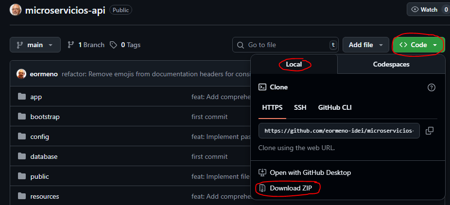
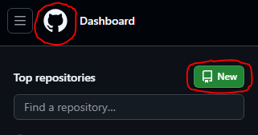
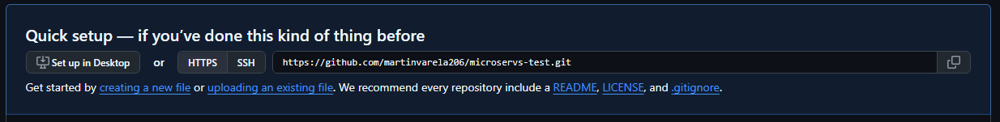
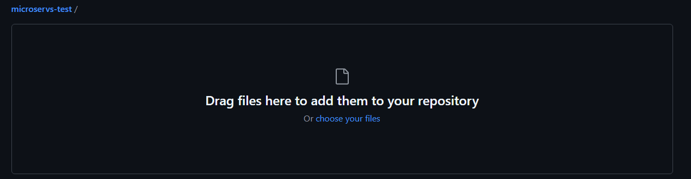
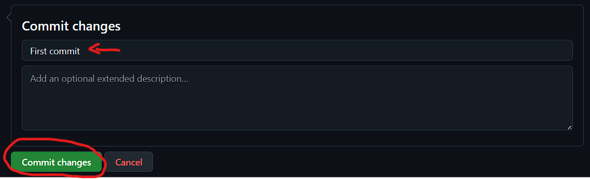
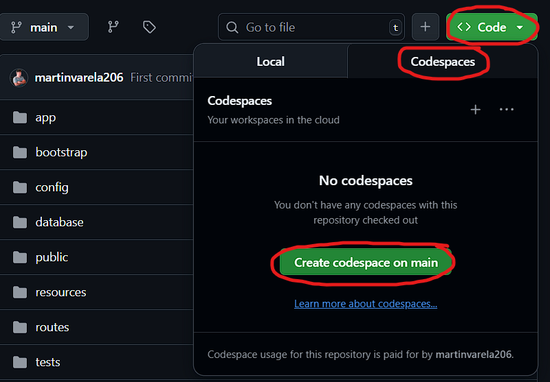

# GitHub Codespaces

## 1. Gestionar cuenta academica

...

## 2. Clonar repositorio

1. Acceder a: <https://github.com/eormeno-idei/microservicios-api>

2. Hacer click en: `<> Code` > `Local` > `Download Zip`.

3. Descomprimir el ZIP del repositorio base.

4. Crear un nuevo repositorio en nuestro Github: `Dashboard` > `New`

5. Subir los archivos del proyecto al repositorio personal: `uploading an existing file`

6. Arrastrar todos los archivos desde la carpeta descomprimida desde el ZIP a la ventana de GitHub.

7. Darle un nombre al commit y confirmar la subida de los archivos:
- Darle un titulo al commit.
- Click en `Commit changes`

## 3. Abrir con Codespace

Luego de confirmado el primer commit, se muestra el repositorio creado. Ahora hay que darle a `<> Code` > `Codespaces` > `Create codespace on main`.

Listo! Con esto se abrirá el proyecto clonado en un Codespace de Github (VSCode en la nube, con toda la arquitectura necesaria instalada para correr el proyecto).